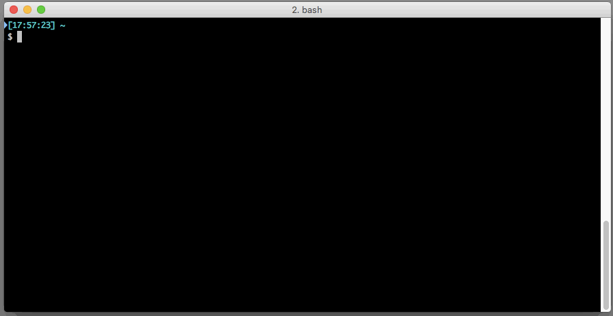
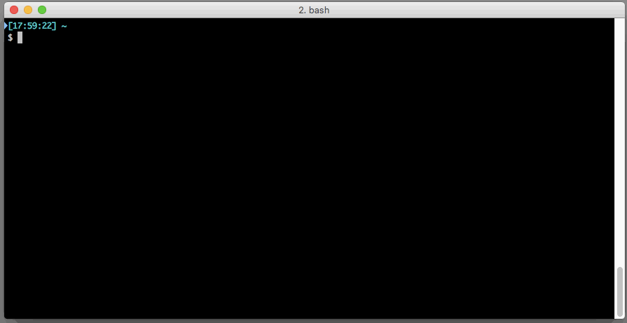

adb-peco [](https://badge.fury.io/rb/adb-peco)
=======

adb-peco is a extension for adb.

When you command `adb shell` on a terminal with several device and emulator are connected, the terminal said like following.



adb-peco make available to choose a device before run the command.



## Installation

### Peco is available on your environment?

`adb-peco` require [peco](https://github.com/peco/peco). So install [peco](https://github.com/peco/peco) at first.

### Installation gem

```bash
gem install adb-peco
```

## Tips

Replace adb command to use adb-peco always.

```bash
alias adb='adb-peco'
```

## Lincense

```
Copyright 2014 tomorrowkey

Licensed under the Apache License, Version 2.0 (the "License");
you may not use this file except in compliance with the License.
You may obtain a copy of the License at

   http://www.apache.org/licenses/LICENSE-2.0

Unless required by applicable law or agreed to in writing, software
distributed under the License is distributed on an "AS IS" BASIS,
WITHOUT WARRANTIES OR CONDITIONS OF ANY KIND, either express or implied.
See the License for the specific language governing permissions and
limitations under the License.
```
