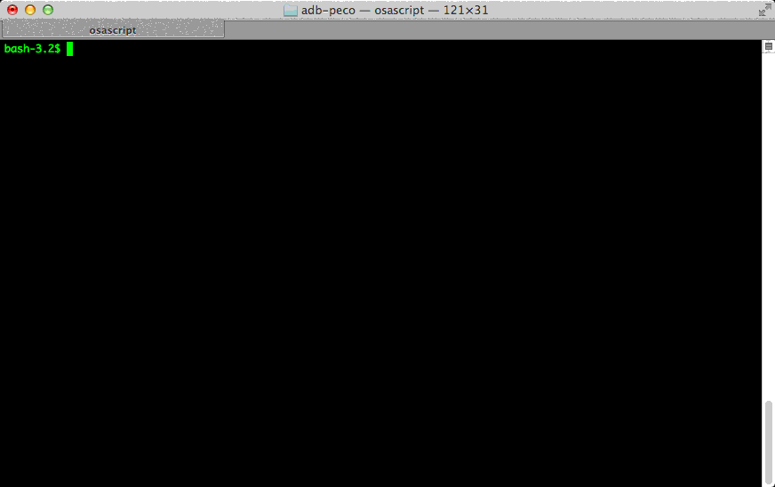

adb-peco
=======

adb-peco is a extension for adb.

When you command `adb shell` on the terminal that more than one devices are connected, the terminal is said like this.


adb-peco make available to choose device after command adb, if more than one devices are connected. like this.



## Quick start
`adb-peco` require [peco](https://github.com/peco/peco) so install [peco](https://github.com/peco/peco) at first.
```bash
git clone git@github.com:tomorrowkey/adb-peco.git
cd adb-peco/bin
adbp shell
```

## Lincense

```
Copyright 2014 tomorrowkey

Licensed under the Apache License, Version 2.0 (the "License");
you may not use this file except in compliance with the License.
You may obtain a copy of the License at

   http://www.apache.org/licenses/LICENSE-2.0

Unless required by applicable law or agreed to in writing, software
distributed under the License is distributed on an "AS IS" BASIS,
WITHOUT WARRANTIES OR CONDITIONS OF ANY KIND, either express or implied.
See the License for the specific language governing permissions and
limitations under the License.
```
